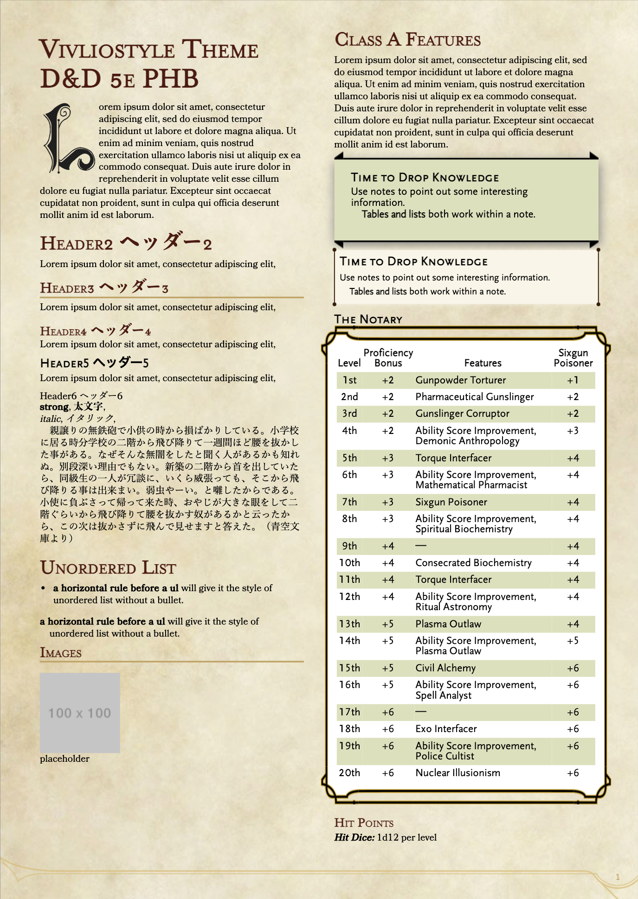

# Vivliostyle Theme Dnd5e Phb

[](https://npmjs.com/package/vivliostyle-theme-dnd-5e-phb)
[](https://npmjs.com/package/vivliostyle-theme-dnd-5e-phb)


D&D 5e PHB theme for Vivliostyle

## Install

```bash
npm install --save vivliostyle-theme-dnd-5e-phb
# or
pnpm add vivliostyle-theme-dnd-5e-phb
```

## Use

In `vivliostyle.config.js`:

```js
module.exports = {
  theme: 'vivliostyle-theme-dnd-5e-phb',
};
```

## Sample Image


## Full sample document

see `example/sample.md`

## Dev
Edit `phbStyle/*`, then run `npm run phb` or `pnpm phb`.

### Preview
```bash
npm run dev
# or
pnpm dev
```

### Validate
Validate before publishing your package.
```bash
npm run validate
# or
pnpm validate
```

## License
This project is licensed under the [MIT license](https://github.com/oldgeese/vivliostyle-theme-dnd5e-phb/blob/master/LICENSE).

Files under `phbStyle` directory are ported from [naturallcrit/homebrewery](https://github.com/naturalcrit/homebrewery). Their license file are placed in [`phbStyle/license`](https://github.com/oldgeese/vivliostyle-theme-dnd5e-phb/blob/master/phbStyle/license).
